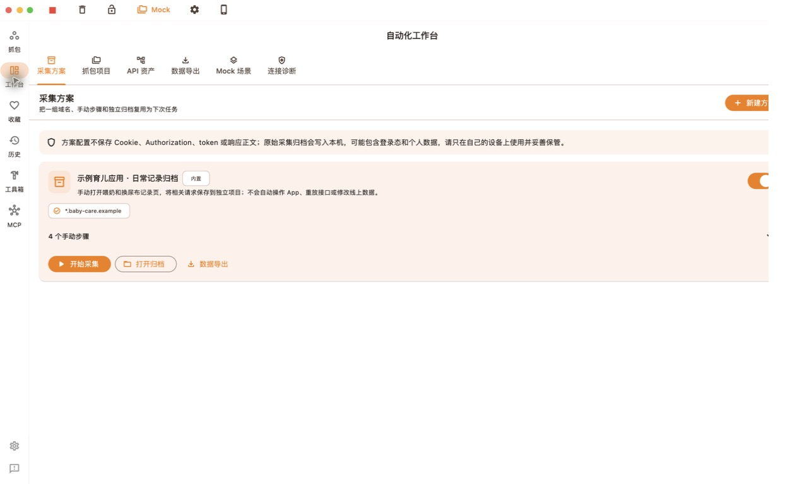
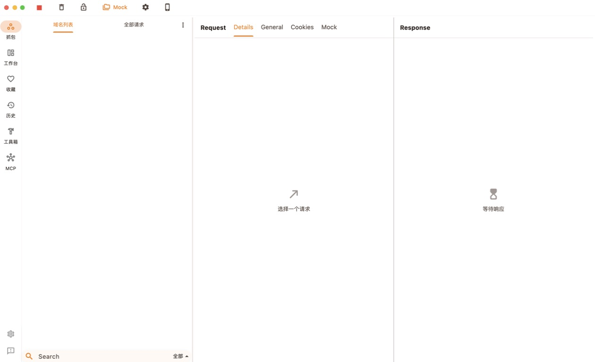
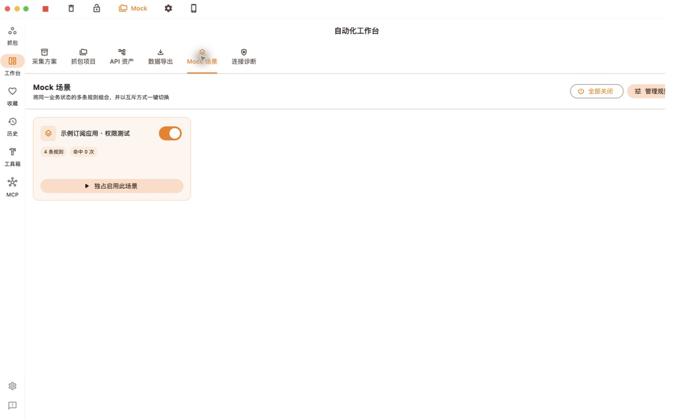

# ProxyPin MCP Workbench

基于 ProxyPin 与 Model Context Protocol（MCP）的自动化抓包、API 分析、Mock 场景和数据归档工作台。

本项目面向开发、测试和个人数据迁移场景，将传统抓包工具里的“查看单条请求”扩展为可以长期复用的工作流：按任务归档请求、整理 API 资产、组合 Mock 规则，并让本地 AI 客户端通过 MCP 分析当前抓包会话。

> 本项目是非官方衍生项目，与 ProxyPin 及下列上游作者不存在官方隶属、授权代理或背书关系。请只分析自己拥有或明确获授权的设备、账号、应用和流量。

## 界面预览

以下截图使用空白状态或匿名示例数据，不包含真实 Token、Cookie、设备标识、用户资料或业务域名。







## 主要能力

- **自动化工作台**：统一管理抓包项目、API 资产、数据导出和 Mock 场景。
- **抓包项目归档**：按任务隔离请求并持续写入独立归档，清空实时列表也不会丢失项目记录。
- **采集方案**：保存域名范围和人工操作步骤，下次可以按同一流程重新采集。
- **API 资产整理**：按方法、路径和响应结构聚合请求，减少重复翻找。
- **数据导出**：从归档中提取结构化记录，导出经过脱敏的 JSON 或 CSV。
- **Mock 场景合集**：多条请求重写规则归入同一合集，通过一个开关整体启停。
- **双列详情视图**：宽屏同时查看 Request 与 Response；窄屏自动回退为标签页。
- **MCP 自动化**：本地 AI 客户端可以搜索请求、读取详情、对比接口和管理授权范围内的 Mock。

仓库中的应用名称、域名和业务场景均为匿名示例，例如“示例育儿应用”和“示例订阅应用”；它们保留完整功能结构，但不指向真实产品或线上服务。

## 快速开始

### 环境要求

- Flutter（建议使用项目配置对应的 FVM 版本）
- macOS、Windows、Linux、Android 或 iOS 开发环境
- macOS 桌面调试需要 Xcode 与 CocoaPods

### 启动 macOS Debug 版本

```bash
fvm flutter pub get
fvm flutter run -d macos
```

如果没有安装 FVM，也可以使用兼容版本的 `flutter` 命令。

### 手机抓包

1. 让手机和运行本项目的电脑连接同一局域网。
2. 在手机 Wi-Fi 中把 HTTP 代理指向电脑的局域网 IP 和应用显示的 HTTP 端口。
3. 先验证普通 HTTP 转发，再安装由当前设备本地生成的 CA。
4. iPhone 安装描述文件后，还需要在“证书信任设置”中开启完全信任。
5. HTTPS 解密尽量限定到正在测试的域名。
6. 完成后关闭手机代理、移除不再使用的 CA，并清理包含凭据的导出文件。

详细流程见仓库内置的 [ProxyPin 抓包工作流 Skill](skills/proxypin-capture-workflow/SKILL.md)。

## MCP 连接

默认情况下，MCP 服务只监听本机回环地址，手机连接的是 HTTP 代理端口，AI 客户端连接的是 MCP 端口，两者不要混用。

```text
MCP 健康检查：http://127.0.0.1:9101/health
MCP JSON-RPC：http://127.0.0.1:9101/message
```

使用仓库内的脱敏客户端：

```bash
python3 skills/proxypin-capture-workflow/scripts/proxypin_mcp.py health
python3 skills/proxypin-capture-workflow/scripts/proxypin_mcp.py tools
python3 skills/proxypin-capture-workflow/scripts/proxypin_mcp.py \
  call search_requests '{"urlKeyword":"example.com","limit":20}'
```

辅助脚本默认遮盖常见 Token、Authorization、Cookie 和密码字段。只有确实需要在本机完成转换时才使用 `--raw`，不要把原始输出提交到仓库或粘贴到公开 Issue。

## 安装 Codex Skill

本项目附带一套可复用的 ProxyPin 工作流：

```text
skills/proxypin-capture-workflow/
├── SKILL.md
├── agents/openai.yaml
├── references/
│   ├── capture-setup.md
│   ├── export-and-mock.md
│   └── mcp-analysis.md
└── scripts/proxypin_mcp.py
```

可以将整个目录复制到 Codex Skills 目录：

```bash
cp -R skills/proxypin-capture-workflow ~/.codex/skills/
```

Skill 包含手机代理诊断、iOS/Android CA 配置、MCP 请求分析、个人数据导出校验和 Mock 合集管理边界。

## 安全与隐私

- 仅处理自己拥有或明确获授权的流量。
- 不要提交 HAR、抓包历史、运行日志、导出数据、Cookie、Authorization、查询 Token、设备标识或家庭成员资料。
- 不要把 MCP 服务暴露到局域网或公网。
- 不提供证书固定绕过、越狱、Root、Frida 注入或第三方付费权益绕过方案。
- Mock 只能用于自己的应用或明确授权的测试环境。
- 安装 CA 等同于授予 HTTPS 解密能力；只信任当前设备本地生成且指纹可核对的 CA。

本分支不再随安装包分发共享 CA 私钥。新安装会在首次启动时于本机应用数据目录生成唯一 CA，私钥在 macOS/Linux 上限制为仅当前用户可读写。由旧版本升级的用户应在证书管理中重新生成一次 CA，并重新安装、核对和信任新证书。更多说明见 [SECURITY.md](SECURITY.md)。

## 开发与验证

```bash
fvm flutter analyze lib/network/util/crts.dart lib/features/workbench
fvm flutter test test/capture_plan_test.dart \
  test/har_archive_recovery_test.dart \
  test/network_panel_split_layout_test.dart \
  test/request_rewrite_diagnostics_test.dart \
  test/workbench_services_test.dart
fvm flutter build macos --debug
git diff --check
```

仓库还保留了部分上游的手工联调脚本，它们依赖本机证书样本、临时文件或本地 HTTP 服务，不属于可离线重复执行的自动化测试；公开发布前以以上定向测试和实际构建为准。

界面改动至少应验证：宽屏与窄屏布局、Request/Response 正文、SSE/WebSocket、Cookies、Mock 诊断和跨断点窗口缩放。

## 上游与致谢

本公开仓库从经过脱敏的代码快照开始记录历史，并基于以下项目继续开发：

- [wanghongenpin/proxypin](https://github.com/wanghongenpin/proxypin)：原始 ProxyPin 项目。
- [SuxyEE/proxypin-mcp](https://github.com/SuxyEE/proxypin-mcp)：早期 MCP 集成实现。
- [ouy160/proxypin-mcp-model](https://github.com/ouy160/proxypin-mcp-model)：本仓库直接采用的代码基线。

感谢所有上游作者和贡献者。上游链接、许可证与详细署名见 [NOTICE](NOTICE)；需要追溯原始实现时，请以对应上游仓库的公开历史为准。

## 许可证

本项目继续采用 [Apache License 2.0](LICENSE)。原项目的版权、许可证和署名信息予以保留；新增代码及修改部分的版权归相应贡献者所有。
